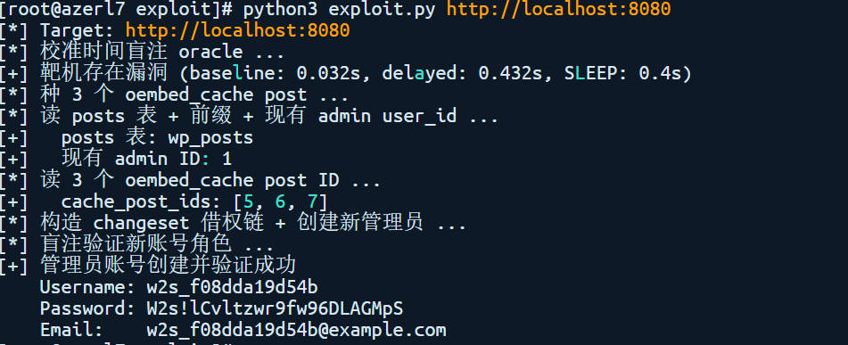
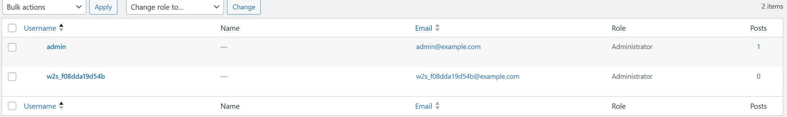

# CVE-2026-63030 + CVE-2026-60137 — WordPress wp2shell 未授权管理员创建链

> **WordPress pre-auth RCE chain | CVSS 3.1: 9.8 CRITICAL | CWE-436 + CWE-89 | 路由错位 × SQL 注入 × changeset 借权** | [复现方法](#复现步骤)
>
> 这条链不是"一个能拿服务器的洞"，是**三个独立看起来都不致命的小漏洞，串成一条完全未授权的接管链路**。
>
> 一个匿名访客只需要发一个 HTTP POST 请求到 `/wp-json/batch/v1`，
> 利用 REST API 批量子请求的**下标错位**（CVE-2026-63030），
> 把对 `/wp/v2/categories` 的合法请求偷偷换给 `/wp/v2/posts` 的 handler 执行，
> 而 posts handler 会把未注册的 `author_exclude` 映射到有缺陷的 `author__not_in`（CVE-2026-60137）。
>
> 拿到 SQL 盲注原语后，再**借 WordPress changeset 的"重入处理"机制**，
> 在批量子请求执行期间临时 `wp_set_current_user(<admin_id>)`，
> 让同 batch 里的两个 `POST /wp/v2/users` 通过权限检查——
>
> 一个原本没有登录态的访客，凭空在数据库里塞进一个 administrator 账号。

---

## 漏洞速览

| 项目 | 内容 |
|------|------|
| **CVE 编号** | CVE-2026-63030（路由错位）+ CVE-2026-60137（SQL 注入） |
| **漏洞代号** | wp2shell |
| **漏洞类型** | 未授权权限提升链（Pre-auth RCE Chain） |
| **CVSS 3.1** | 9.8 CRITICAL（组合评分，`AV:N/AC:L/PR:N/UI:N/S:C/C:H/I:H/A:H`） |
| **CWE** | CWE-436 (Interpretation Conflict) + CWE-754 + CWE-89 + CWE-843 |
| **受影响版本（63030）** | WordPress 6.9.0–6.9.4，7.0.0–7.0.1 |
| **受影响版本（60137）** | WordPress 6.8.0–6.8.5，6.9.0–6.9.4，7.0.0–7.0.1 |
| **修复版本** | 6.8.6 / 6.9.5 / 7.0.2 |
| **发现方** | sergiointel（独立研究者） |
| **公开时间** | 2026-07-17 官方补丁 / 2026-07-20 完整利用链与深度分析公开 |
| **利用条件** | 纯匿名，**无需任何认证 / 任何用户 / 任何插件** |
| **修复提交** | `GHSA-ff9f-jf42-662q`（63030）、`GHSA-fpp7-x2x2-2mjf`（60137） |
| **仓库 PoC** | [`exploit/exploit.py`](exploit/exploit.py) |
| **上游 PoC** | https://github.com/sergiointel/wp2shell-poc |
| **官方公告** | https://wordpress.org/news/2026/07/wordpress-7-0-2-release/ |
| **深度分析** | https://bugbunny.ai/blog/wordpress-7-0-2-rce-deep-dive |

---

## 受影响范围

### 核心影响

```text
WordPress 6.8.x（仅 SQL 注入，单独存在，无 RCE 链）
WordPress 6.9.0 – 6.9.4（两个漏洞都在，完整 RCE 链）
WordPress 7.0.0 – 7.0.1（两个漏洞都在，完整 RCE 链）
```

- 完整 wp2shell 链需要**两个漏洞同时存在**
- WordPress 6.8 系列只受 SQL 注入单独影响，**不能拼出 RCE 链**
- Wordfence 估算全球仍有约 **9000 万** WordPress 站点运行受影响版本
- 官方在补丁发布当日对支持自动更新的站点启用了**强制升级**

### 受影响组件

| 组件 | 漏洞 | 说明 |
|------|------|------|
| `WP_REST_Server::serve_batch_request_v1()` | 63030 | 批量请求处理中 `$validation` 与 `$matches` 数组下标错位 |
| `WP_Query::parse_query()` | 60137 | `author__not_in` 字符串值原样拼到 SQL |
| `/wp/v2/categories` handler | 63030（间接） | 不注册 `author_exclude` 但被错位时执行不属于自己的代码 |
| `/wp/v2/posts::get_items()` | 60137（间接） | `author_exclude` 软别名映射到有缺陷的 `author__not_in` |
| `WP_Customize_Manager::save_changeset_post()` | 借权 | 临时 `wp_set_current_user()` 的作用域超出 changeset 处理 |
| WordPress changeset 重入调度 | 借权 | `request` 类型对象被处理时递归触发 changeset 发布 |

---

## 根因分析

wp2shell 不是"一个洞"——它是**三处看似合理的逻辑拼在一起后，整条防线失效**。
bugbunny 的 deep dive 把这归结为**"三个被打破的假设"**。

### 第一个假设：批量请求的校验和路由是同步的

> 正常预期：`$validation[i]` 和 `$matches[i]` 永远长度一致。

`WP_REST_Server::serve_batch_request_v1()` 遍历批量子请求时，校验失败只写 `$validation[]`、不写 `$matches[]`：

```php
foreach ($requests as $i => $request) {
    if (路由匹配失败) {
        $validation[$i] = new WP_Error('no_route', ...);
        continue;                              // ❌ $matches[$i] 槽位空缺
    }
    $matches[$i] = $request->get_route_match();
    $validation[$i] = true;
}

// 后续处理用 $matches[$i] 拿 handler —— 下标已经错位
```

**打破方式**：当子请求的 path 是 `"http://:"`（一个绝对 URL 但 host 为空）这种**必然解析失败**的形态时，`$validation` 多一项、`$matches` 少一项。下一轮 `foreach` 取出来的"路由"是上一个成功匹配项的路由。

攻击者用这个错位，**让本该由 `/wp/v2/posts` 处理的子请求，被当作"批量子处理路由"**。

> 修复思路：`$matches` 用 `array_values()` 重置下标；或失败时同步写 `$matches[$i] = null`。

### 第二个假设：未注册的 query 参数会被丢弃

> 正常预期：REST API 收到不认识的参数，应该直接丢弃。

`/wp/v2/categories` 注册时**没有** `author_exclude` 这个 query 参数。按白名单机制，这个参数**应该被丢弃**。

但**第一个假设被打破之后**，请求执行权落到了 `/wp/v2/posts` 的 `get_items()` 处理器。posts 接口有 `author_exclude` 这个"软别名"，会把它映射到底层 `WP_Query` 的 `author__not_in`：

```php
// 漏洞版本：字符串值原样拼到 SQL
$q['author__not_in'] = $input['author_exclude'];  // 比如 "1) AND 1=0 UNION ALL SELECT ..."

if (!is_array($q['author__not_in'])) {
    // ❌ 应该在这里 $q['author__not_in'] = array_map('intval', (array)$q['author__not_in']);
    // 但漏洞版本没做这个类型强转
}

$where .= " AND post_author NOT IN ({$q['author__not_in']})";
```

**打破方式**：当 `author_exclude=1) AND 1=0 UNION ALL SELECT ...` 时，SQL 变成：

```sql
SELECT ... FROM wp_posts
WHERE post_author NOT IN (1) AND 1=0 UNION ALL SELECT <攻击者控制的行> ...
```

`post_author NOT IN (1)` 没结果（因为 admin ID=1），但 `UNION ALL SELECT` 后是我们控制的数据——**未授权的 SQL 注入就这样成立了**。

> 修复思路：要么强制数组化 + intval；要么在 routes 注册时严格校验参数白名单（这才是正确思路）。

### 第三个假设：changeset 的 `user_id` 只在自定义器上下文里有效

> 正常预期：`WP_Customize_Manager::save_changeset_post()` 临时切到 `user_id` 的操作，作用域应该只限于 changeset 处理这一小段。

WordPress 处理 changeset 的流程天然有一段**重入逻辑**：当 changeset 的 `post_content` 引用了其他对象（比如 `nav_menu_item`），WordPress 会去加载那些对象；如果那些对象是 `request` 类型，**会触发 changeset 重新调度**。

攻击者把这个机制用成了一个"无限循环触发器"：

```text
cache_post_ids[0] (customize_changeset, 含 admin user_id)
       ↑ parent
outer_loop_id (post)
       ↑ parent
cache_post_ids[1] (post)
       ↑ parent
nav_item_id (nav_menu_item)
       ↑ parent
cache_post_ids[2] (request)   ← 关键：触发 changeset 重入
       ↑ parent
inner_loop_id (post)
       ↑ parent
（回到 cache_post_ids[0]）
```

每次循环到 changeset 时，WordPress 调用 changeset 的"发布"逻辑：

```php
public function save_changeset_post($changeset_post_id, ...) {
    $user_id = $this->get_post_value($changeset_post_id, 'user_id');
    if ($user_id) {
        wp_set_current_user($user_id);   // ←── 借权的关键
    }
    // ...保存设置...
}
```

`wp_set_current_user($user_id)` 是 WordPress 的"临时切换当前用户"函数。**它的作用域是整个 PHP 请求的生命周期**，不只是 changeset 处理这一段。

所以当这个 changeset 在批量子请求执行期间被"发布"时，**后续的 batch 处理**——包括同 batch 里我们塞的两个 `POST /wp/v2/users`——都会以 admin 身份跑通权限检查。

> 修复思路：要么 changeset 不允许未授权的"重入触发"（`request` 类型的对象应该受权限检查），要么 `wp_set_current_user` 的作用域应该用 try/finally 限定在 changeset 处理函数内。

### 三个假设打破后的总图

```text
匿名访客 POST /wp-json/batch/v1
  │
  ├─► 假设 1 被打破：batch 子请求下标错位
  │     └─► /wp/v2/categories 的请求被 /wp/v2/posts 接管
  │
  ├─► 假设 2 被打破：posts handler 把 author_exclude 映射到 author__not_in
  │     └─► 未授权 SQL 注入
  │     ├─► 阶段 2：注入 1 行 wp_posts 假行（含 3 个 [embed] 短码）
  │     │     └─► WP 自动写 3 条 oembed_cache 隐藏文章
  │     ├─► 阶段 3：盲注读 admin user_id + 3 个 oembed_cache ID
  │     │
  │     └─► 阶段 4：UNION ALL SELECT 注入 7 行 wp_posts 假数据
  │           └─► 构造 changeset 父子环
  │
  └─► 假设 3 被打破：changeset 重入触发 wp_set_current_user(admin_id)
        └─► 同 batch 里的 POST /wp/v2/users 借权创建管理员
              └─► 浏览器登录 → 上传恶意插件 → RCE
```

> **核心问题不是任何单点，而是"接口在不同层次分别做了检查，但没有在整体授权模型上形成闭环"**——和 LiteLLM CVE-2026-47101 是同一种结构性问题。

---

## 利用机制

### 攻击链路总图

```text
匿名访客 → POST /wp-json/batch/v1 (1 个 HTTP 请求)
   │
   │  外层 batch（3 个子请求，下标错位触发）
   │  ├─ POST /?path=http://:           (失败 → $validation 写、$matches 不写)
   │  └─ POST /wp/v2/posts              (错位执行内层 batch)
   │     │
   │     │  内层 batch（5 个子请求）
   │     │  ├─ GET /?path=http://:                          (再次错位)
   │     │  ├─ GET /wp/v2/widgets?author_exclude=<SQL>     (SQL 注入点)
   │     │  │     └─ 阶段 2 注入 1 行假行 → 触发 3 个 oembed_cache 写入
   │     │  ├─ GET /wp/v2/posts                            (兜底)
   │     │  ├─ POST /wp/v2/users (借权后第 1 次)
   │     │  └─ POST /wp/v2/users (借权后第 2 次，双保险)
   │     │
   │     └─ 阶段 3 注入 7 行假行 → changeset 借权 → admin 身份建立
   │
   └─► 阶段 5 盲注验证新账号是 administrator
```

### 利用阶段分解

| 阶段 | HTTP 数 | 任务 | 关键 SQL / 操作 |
|------|--------|------|-----------------|
| 1 | 多次（盲注） | 校准时间盲注阈值 | `SELECT IF(1=1,SLEEP(0.4),0)` |
| 2 | 1 | UNION 注入 1 行假行，种 3 个 oembed_cache | `UNION ALL SELECT <wp_posts 假行>` |
| 3 | 多次 | 盲注读 admin user_id + 3 个 cache ID | `SELECT ID FROM wp_posts WHERE post_type='oembed_cache'` |
| 4 | 1 | UNION 注入 7 行假行，借权创建用户 | `UNION ALL SELECT <7 行 wp_posts 假行>` |
| 5 | 多次 | 盲注验证新账号是 administrator | `EXISTS(SELECT 1 FROM wp_users JOIN wp_usermeta ...)` |

> 全部加起来只需要 **1 个匿名 HTTP POST 请求**（加上若干次盲注探测请求），就能拿到 administrator 账号。

### PoC 脚本设计

`exploit/exploit.py` 是本仓库的最小可用 PoC，按阶段拆分函数：

```
Wp2ShellExploit
├── send_batch()         阶段 1：嵌套 batch + 路由错位
├── probe_time()         阶段 1：时间盲注原语
├── calibrate()          阶段 1：阈值校准
├── get_scalar()         阶段 3：二分盲注字符串
├── get_integer()        阶段 3：二分盲注整数
├── seed_oembed_posts()  阶段 2：UNION 注入 1 行假行
├── recover_database_context()  阶段 3：读 admin ID
├── recover_cache_post_ids()    阶段 3：读 3 个 cache ID
├── create_administrator()      阶段 4：UNION 注入 7 行假行 + 借权
└── administrator_exists()      阶段 5：盲注验证
```

每一步都用 `[*] / [+] / [!]` 前缀输出进度，便于在 shell 里观察。

---

## 复现步骤

> 仅在你拥有或获得明确授权的本地测试环境中执行。
> **不要**在生产博客或未授权的 WordPress 站点上跑这条链。

### 环境要求

- Python 3.9+
- `requests`（仅当 import 时报错，标准库其实够用）
- Docker / Docker Compose
- 受影响版本 WordPress（本仓库环境使用 vulhub 官方 6.9.4 镜像）

### 方法 1：使用本仓库 Docker 一键环境

```bash
cd "CVE-2026-63030 wp2shell"
docker compose up -d
# 等 1-2 分钟让 MySQL 初始化完
```

漏洞版本默认监听：

```text
http://localhost:8080
```

环境说明：
- 首次启动时自动完成 WordPress 安装（无需向导）
- 默认管理员账号 `admin / admin`
- 默认含一篇 "Hello world!" 公开文章（PoC 的 oembed 种子需要这篇）

确认环境就绪：

```bash
curl -s http://localhost:8080/?rest_route=/wp/v2/posts&per_page=1 | python3 -m json.tool
# 应该能看到 "Hello world!" 的 JSON
```

### 方法 2：使用本仓库 PoC 脚本

```bash
cd "CVE-2026-63030 wp2shell/exploit"
```

先用 `--check` 验证 SQL 注入存在（不创建任何账号）：

```bash
python3 exploit.py http://localhost:8080 --check
# 期望输出：
# [*] Target: http://localhost:8080
# [*] 校准时间盲注 oracle ...
# [+] 靶机存在漏洞 (baseline: 0.412s, delayed: 0.821s, SLEEP: 0.4s)
# [*] --check 模式：已验证 SQL 注入存在，未创建账号
```

跑完整链：

```bash
python3 exploit.py http://localhost:8080
```

成功时输出：

```text
[*] Target: http://localhost:8080
[*] 校准时间盲注 oracle ...
[+] 靶机存在漏洞 (baseline: 0.412s, delayed: 0.821s, SLEEP: 0.4s)
[*] 种 3 个 oembed_cache post ...
[*] 读 posts 表 + 前缀 + 现有 admin user_id ...
[+]   posts 表: wp_posts
[+]   现有 admin ID: 1
[*] 读 3 个 oembed_cache post ID ...
[+]   cache_post_ids: [4, 5, 6]
[*] 构造 changeset 借权链 + 创建新管理员 ...
[*] 盲注验证新账号角色 ...
[+] 管理员账号创建并验证成功
    Username: w2s_<随机>
    Password: W2s!<随机>
    Email:    w2s_<随机>@example.com
```



浏览器确认：登 `http://localhost:8080/wp-admin/`，Users 页面会看到新建的 `w2s_<随机>` 和原 `admin` 并列。



自定义用户名 / 邮箱 / 密码：

```bash
python3 exploit.py http://localhost:8080 \
    --username azerl7 --email azerl7@example.com --password 'AZERL7'
```

### 方法 3：参考上游 PoC 一键复现

```bash
git clone https://github.com/sergiointel/wp2shell-poc.git
cd wp2shell-poc
# 上游仓库有自己的 docker-compose 与脚本
```

### 方法 4：手动 curl 复现（不推荐，仅作原理验证）

要手动拼嵌套 batch + UNION SELECT payload 几乎不现实——7 行假数据的 changeset 是嵌套 JSON，盲注 payload 单条就 1-2KB。**强烈建议用方法 2**。真要手动也得用 Python `requests`，不建议用 curl。

### 预期效果

成功时应看到：

- 终端打印出 `管理员账号创建并验证成功` 和凭据
- WordPress 后台 `wp-admin/users.php` 出现新管理员
- 浏览器能直接登入新账号
- 新账号具有完整 administrator 权限，可上传插件 / 主题 → RCE

### 失败排查

| 现象 | 可能原因 | 排查方法 |
|------|----------|----------|
| 校准失败（"靶机不像有漏洞"） | WP 版本已修复 | 检查 `wp-includes/version.php` |
| baseline 很高（>2s） | MySQL 容器压力大 | `docker stats` 看容器资源 |
| SLEEP 触发不到 | MySQL 没启用 SLEEP 函授 | 极少数精简镜像会禁用，换 mysql:8.0 完整版 |
| PoC 跑通但 wp-admin 找不到新账号 | 借权没生效 | 看 MySQL 慢查询日志确认 7 行 UNION 是不是进了 wp_posts |
| 数据库锁死 | 同时跑多个 PoC 实例 | 串行跑，或 `docker compose restart db` |

---

## 修复方案

### 方案一：升级 WordPress（推荐）

直接升级到：

```text
WordPress 6.8.6+    （修 60137 SQL 注入，但 63030 路由错位可能还在）
WordPress 6.9.5+    （同时修两个 CVE）
WordPress 7.0.2+    （同时修两个 CVE）
```

**官方建议**：7.0 用户升 7.0.2；6.9 用户升 6.9.5；6.8 用户至少升 6.8.6。

对支持自动更新的站点，官方已在 7 月 17 日启动**强制升级**。

### 方案二：临时缓解 — 关闭批量端点

如果你不能立即升级，可以在 `functions.php` 或自定义插件里加：

```php
// 禁用 REST API 批量端点
add_filter('rest_endpoints', function($endpoints) {
    unset($endpoints['/batch/v1']);
    return $endpoints;
});
```

这能切断 CVE-2026-63030 的入口，但**单独看 CVE-2026-60137 的 SQL 注入**仍然是 9.8 严重度（虽然没批量错位接缝就难以触发到未授权接口）。

### 方案三：临时缓解 — 关闭 oembed 解析

切断 wp2shell 的"种"环节：

```php
// 禁用 oembed 自动发现
add_filter('embed_oembed_discover', '__return_false');

// 关闭 oembed_cache 写入
add_filter('oembed_ttl', '__return_zero');
```

代价：博客里嵌入的 YouTube/B 站等视频可能不显示。

### 方案四：临时缓解 — 关闭自定义器

切断 wp2shell 的"借权"环节：

```php
// 禁用自定义器（changeset 处理入口）
add_filter('customize_enabled', '__return_false');
```

代价：主题实时自定义预览功能不可用。

### 方案五：组合缓解

**最稳妥的临时组合**（不需要升级但能完全切断 wp2shell）：

```php
// 1. 关闭批量端点
add_filter('rest_endpoints', function($e) {
    unset($e['/batch/v1']);
    return $e;
});

// 2. 关闭 oembed 解析
add_filter('embed_oembed_discover', '__return_false');
add_filter('oembed_ttl', '__return_zero');

// 3. 关闭自定义器
add_filter('customize_enabled', '__return_false');
```

这三个一起关，wp2shell 整条链的 4 个阶段全部切断。代价主要是博客的"嵌入"和"主题预览"功能不可用——大多数生产博客**不会因此有可见问题**。

---

## 检测与排查

### 1. 是否有异常的批量请求

检查 nginx / Apache / 应用层日志，关注：

```text
POST /wp-json/batch/v1
POST /?rest_route=/batch/v1
POST /wp/v2/categories  (内层错位请求的特征)
POST /wp/v2/widgets     (内层错位请求的特征)
```

`/wp/v2/categories` 和 `/wp/v2/widgets` 通常是 GET，但攻击 payload 是 GET + URL 里带 `author_exclude`——可以基于异常参数名建规则。

### 2. 是否有异常的盲注请求

时间盲注的特征是**同一 URL 重复出现 + 响应时间离散**：

- 看响应时间分布（用 `tcpdump` 抓包分析）
- 看 MySQL 慢查询日志（`long_query_time=0` 时所有 `SLEEP()` 都进慢日志）
- 看 `general_log` 里有没有 `SLEEP` 关键字

### 3. 是否有异常的 changeset / oembed_cache post

wp2shell 跑过之后，`wp_posts` 表里会有异常数据：

```sql
-- 查 oembed_cache 类型但 post_name 不像 MD5(URL+size) 的
SELECT ID, post_name, post_type, post_parent, post_status
FROM wp_posts
WHERE post_type='oembed_cache';

-- 查 post_type=customize_changeset 但 post_author 不是合法用户
SELECT ID, post_author, post_type, post_status, LEFT(post_content, 80)
FROM wp_posts
WHERE post_type='customize_changeset';

-- 查 post_type=request 的（正常 WP 几乎不会有）
SELECT ID, post_author, post_type, post_parent
FROM wp_posts
WHERE post_type='request';

-- 查 ID 异常大（1.8e9+）的
SELECT ID, post_type, post_parent, LEFT(post_content, 60)
FROM wp_posts
WHERE ID > 1000000000;
```

发现异常 → 立即：

1. 改所有管理员密码
2. 检查 `wp_users` 是否有不明账号
3. 检查 `wp_usermeta` 里 `wp_capabilities` 是否含 `administrator`
4. 升级到修复版本
5. 审计上传的插件 / 主题目录

### 4. WAF 规则参考

```nginx
# 拦截 batch 子请求里 author_exclude 出现 SLEEP/UNION
if ($query_string ~ "(author_exclude|excerpt|search)=.*(SLEEP|UNION|SELECT|0x)") {
    return 403;
}
```

这是粗规则，**会误报**（不推荐在生产直接上），仅适合临时蜜罐。

---

## 时间线

| 日期 | 事件 |
|------|------|
| 2026-07 上旬 | sergiointel 向 WordPress 安全团队报告 |
| 2026-07-17 | WordPress 官方发布 6.8.6 / 6.9.5 / 7.0.2 安全版本 |
| 2026-07-17 | 官方对支持自动更新的站点启动强制升级 |
| 2026-07-20 | bugbunny.ai 发布"three fixes for three broken assumptions" deep dive |
| 2026-07-20 | vulhub 同步放出 PoC 与复现环境 |
| 2026-07-22 | 各大中文安全媒体跟进（奇安信、FreeBuf 等） |
| 2026-08-10 | 本仓库按 poc-lab 模板补全文档与本地 PoC |

---

## 参考资料

| 来源 | 链接 |
|------|------|
| WordPress 7.0.2 官方公告 | https://wordpress.org/news/2026/07/wordpress-7-0-2-release/ |
| GHSA 63030 advisory | https://github.com/WordPress/wordpress-develop/security/advisories/GHSA-ff9f-jf42-662q |
| GHSA 60137 advisory | https://github.com/WordPress/wordpress-develop/security/advisories/GHSA-fpp7-x2x2-2mjf |
| bugbunny deep dive | https://bugbunny.ai/blog/wordpress-7-0-2-rce-deep-dive#three-fixes-for-three-broken-assumptions |
| 上游 PoC 仓库 | https://github.com/sergiointel/wp2shell-poc |
| vulhub 环境仓库 | https://github.com/vulhub/vulhub/tree/master/wordpress/CVE-2026-63030 |
| WordPress REST API 文档 | https://developer.wordpress.org/rest-api/batch-delete/ |
| WordPress changeset 文档 | https://developer.wordpress.org/themes/customize-api/ |
| 奇安信 / SecRSS 通告 | https://www.secrss.com/articles/90705 |
| 腾讯云开发者社区分析 | https://cloud.tencent.com/developer/article/2713079 |
| 本仓库 PoC | [`exploit/exploit.py`](exploit/exploit.py) |

- 以上链接最后访问时间：2026-08-10
- CVE 与受影响版本以 WordPress 官方公告和 NVD 为准
- bugbunny 那篇是讲"三个被打破的假设"的必读资料，但站点可能被反爬，用 archive.org 兜底

---

## 免责声明

本项目仅用于授权安全研究、漏洞复现、资产自查与防御验证。

请勿在未授权的 WordPress 站点上运行本 PoC。该脚本会**实际在数据库里创建数据**（3 条 oembed_cache 隐藏文章 + 1 个 administrator 账号），可能对业务系统产生实际影响。即使在授权环境跑完之后，也建议 `docker compose down -v` 重新初始化。

**重要**：本 PoC 会留下痕迹（oembed_cache post、changeset post、新管理员账号）。在生产或重要测试环境跑之前，请确认有完整的备份与回滚方案。

- 上游参考：vulhub 官方 PoC 由 sergiointel 公开
- 本仓库 PoC 由 poc-lab 团队为教学目的重写，加详细中文注释
- 任何滥用责任由使用者承担
